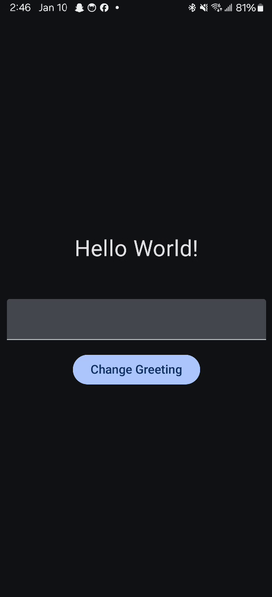
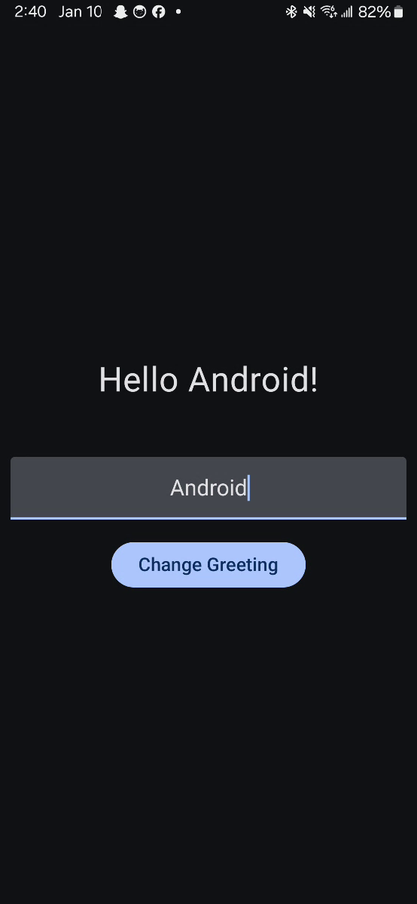

# HelloWorld

**HelloWorld** is a simple Android application built using Jetpack Compose. The app displays a greeting message and allows the user to input their name, which updates the greeting message accordingly.

<br>
    <div style="display: flex; gap: 10px;">
        
        
    </div>
<br>

## Getting Started

### Prerequisites

- Android Studio
- Kotlin
  
### Open the Project

1. Clone or download the repository:

    ```bash
    git clone https://github.com/yourusername/HelloWorldApp.git
    ```

2. Open the Project in Android Studio.

3. Sync the Gradle files by clicking **Sync Now** when prompted in Android Studio.

### Building the App

1. **Using Android Studio:**
   1. Open Android Studio and load your project.
   2. Click on the **Build** menu at the top of the window.
   3. Select **Make Project**. *(or **Shift+F9** on Windows/Linux - **Command+F9** on Mac)*
   4. Once the build is successful, you can run the app.
2. **Using CLI:**
   1. Navigate to the project directory:
 
        ```bash
        cd HelloWorld
        ```
   2. Run the following command to build the project:
  
        ```bash
        ./gradlew build
        ```

This will compile the app and generate APK/AAB files in the build output directory.

### Running the App

1. **Using Android Studio:**
   1. Connect your Android device via USB or start an emulator.
   2. Click the green **Run** button *(or **Shift+F10** on Windows/Linux - **Command+F10** on Mac)*
   3. The app will launch on your device/emulator.

2. **Using CLI:**
   1. Ensure your device is connected or emulator is running.
   2. Navigate to the project directory:

        ```bash
        cd HelloWorld
        ```

   3. Run the following command to install the debug APK on the connected device/emulator:

        ```bash
        ./gradlew installDebug
        ```

   This will install and launch the app on your connected Android device or emulator.

## Tech Stack

- **Kotlin** for programming
- **Jetpack Compose** for UI components
- **Material 3** for modern design components